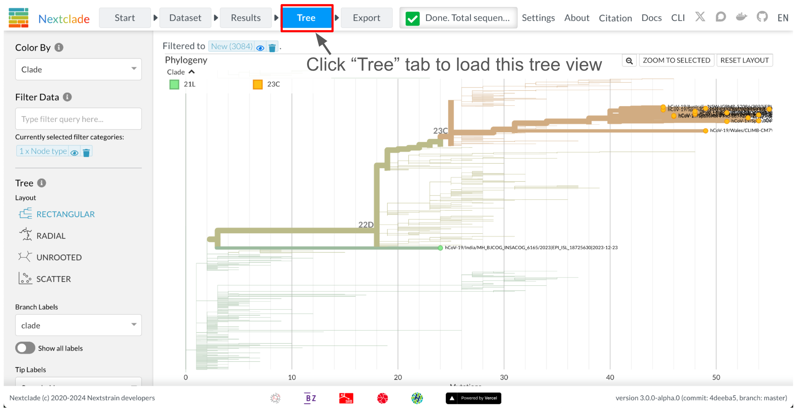

### Phylogenetic tree view

In order to assign clades to sequences, Nextclade [places](../algorithm/05-phylogenetic-placement) all new sequences on a reference tree. You can view the resulting tree by clicking on the tree icon at the top right.

The tree is visualized by [Nextstrain Auspice](https://docs.nextstrain.org/projects/auspice/en/stable/). By default, only your uploaded sequences are highlighted.

Since Nextclade v3, Nextclade runs a very simple greedy tree builder on user provided sequences. This means that approximate ancestral relationships between your sequences are visible on the tree. Given the simplicity of the tree builder, the tree is not guaranteed to be optimal. For a more accurate tree including your sequences, you can use [Usher](https://genome.ucsc.edu/cgi-bin/hgPhyloPlace), which works out of the box with SARS-CoV-2, hMPXV, RSV-A, and RSV-B, as of January 2024.

